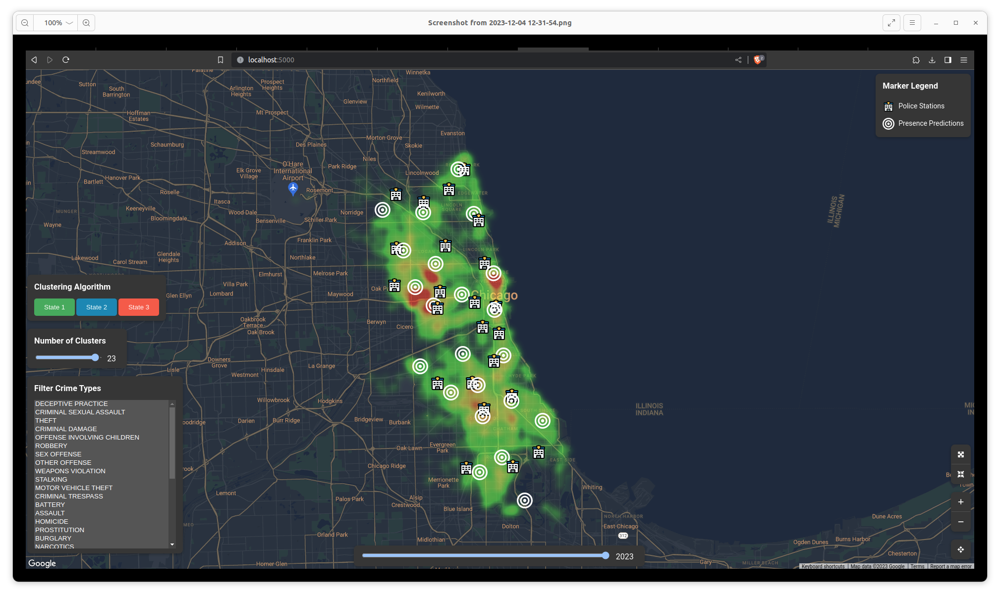
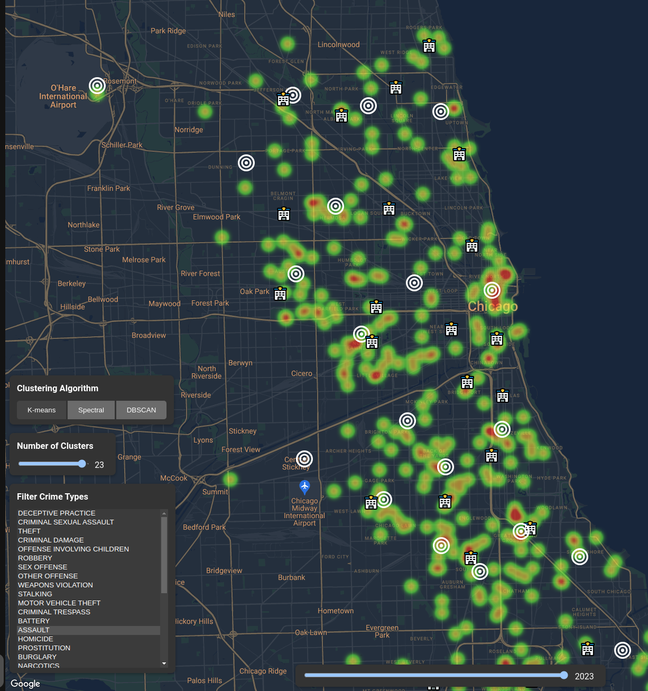
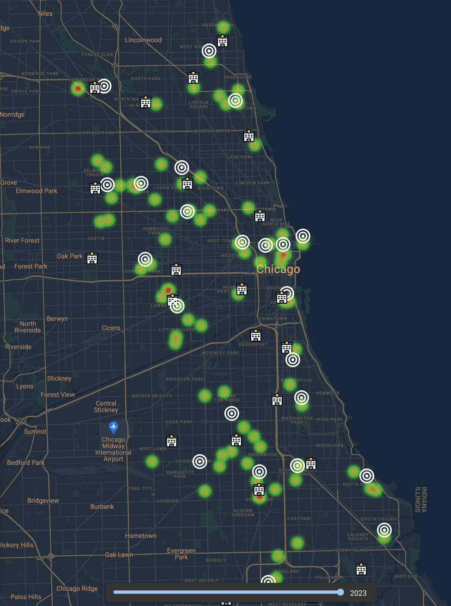

# An Analysis of Violent Crimes in the City of Chicago from the years 2001 to 2023

> Zak Kastl, Mario Ruoff, Julissa Hutchison-Ybarra

## Abstract

## 1. Introduction

In every society throughout history, criminal behavior has hindered the normal operation of that society. Webster defines *crime* as 'an illegal act for which someone can be punished by the government'[[1]](https://www.merriam-webster.com/dictionary/crime). When a crime is committed, all of society suffers, and the individual cost can vary wildly with the type of crime committed. An 2010 analysis of the various costs of crime by McCollister, French, and Fang[[2]](https://doi.org/10.1016/j.drugalcdep.2009.12.002) estimates the cost of a single murder, including tangible and non-tangible costs, at around 9 million dollars. In the City of Chicago, there were 494 murders in 2023 as of October 14. [[3]](https://data.cityofchicago.org/Public-Safety/Crimes-2001-to-Present/ijzp-q8t2) This would put the total cost for citizens of Chicago at around $4.4 billion dollars.  Similarly, the cost of a rape/sexual assault this year is around three million dollars.

While the costs due to crime can be very large, often police budgets are reduced in times of austerity. The has been reported in various news articles[[X]] with the ... It is also known that crime affects a city unevenly, with incidents of crime being more likely in particular areas of a city over other parts. It makes sense that police presence should reflect the distribution of crimes in the city.

In Machine Learning, the technique of clustering divides points of data into different clusters or categories. Additional points of data can then be classified as being part of one of those categories. However, We believe there is more that we can visualize in regards to the clustering of crimes. To this end, we have developed a Python-based web application to examine and analyze the distribution of crime in the city of Chicago. The application uses multiple forms of clustering algorithms to examine the distribution of different type of crime and to provide clusters in order to examine the distribution of crimes in relation to police stations.

This paper will examine three different clustering algorithms that are currently available and plot the cluster centers as a Google Maps overlay. It will allow an examination of clustering as a function of a particular crime type and will compare those clustering with the true locations of police stations within the city.

## 2. Prior Work

Put prior work stuff here

## 3. Chicago Crime Dataset

For a thorough examination of crime, we are utilizing the Chicago Crime Dataset[3]. This dataset, provided by the city of Chicago, is a record of all reported crimes committed in the city from the year 2001 until the present day. The dataset provides anonymized crime statistics, including the primary crime type, location, and the latitude and longitude (partially anonymized) of the crime. It also provides whether the crime resulted in an arrest or if it is classified as a domestic. We decided to use this dataset due to its exceptional quality and robustness.


The only preprocessing work we had to perform on this dataset was to reduce certain dimensions that were unnecessary or redundant. Additionally, we chose to only examine crime statistics on a single-year basis. This is partially due to the sheer size of the record list on the application, but also to isolate the changing trends in demographics, affluence, and structure that may affect results beyond simple police station location. In the end, we reduced the dataset down to the following dimensions:

- Datetime of the crime committed
- Year crime was committed (seemingly redundant, but allows for easier retrieval of the data by year).
- Crime's Primary Type - One of 33 different primary crime types that the user can filter on.
- Description - A description of the crime committed.
- Location Description - A short description of the location where the crime was committed: e.g. 'Street' or 'Residence'.
- Was an arrest made?
- Is this considered a domestic crime?
- Latitude/Longitude where the crime was committed.


## Clustering Algorithms

For this application, we have implemented three separate clustering algorithms: **KMeans Clustering**, **DBSCAN**, and **Spectral Clustering**.

### KMeans

This clustering algorithm, first formally proposed by Lloyd in 1982 [5](https://cs.nyu.edu/~roweis/csc2515-2006/readings/lloyd57.pdf), is the defacto standard for clustering algorithms in machine learning. K-Means is easy to implement, although computationally hard through a technique known as Lloyd's algorithm. In Lloyd's algorithm, a number of entries in the dataset, K, are selected at random from the entire set. Then, a distance metric, often the Euclidean or Manhattan distance metrics are applied to each point in the data to each of the cluster centers selected earlier. The point is "assigned" to the cluster with the shortest distance. After each point is assigned, the centers of each cluster are moved to the mean of the points in the cluster. Then the process is repeated until either the centers no longer move or a specified number of iterations have passed.

LLoyd's Algorithm (in a Python pseudo-code style)

```python

def LloydsAlgorithm(data, k, max_iterations):
    
    # Select k rows from the data
    centers = [select random k rows for row in data]
    clusters = []

    while i < max_iterations:
        # Assign a row to the closest center
        for row in data:
            clusters[center].add(row if euclidian_distance(row) < all_other_centers)

        # Update the centers to the mean of the points in the cluster
        for cluster in clusters:
            centers[cluster] = mean(cluster[cluster])

        # Repeat until the centers no longer move
        if centers not Move():
            break
```

[Figure 1: Pseudocode for Lloyd's algorithm]

The primary advantage with this algorithm is its simplicity of implementation along with its wide application. However, it is an NP-hard problem in higher dimensions, and other clustering algorithms have outpaced it in performance and it is not guaranteed to find the optimum distribution. Furthermore, the initial cluster centers and the value of **K** used affect it greatly. Still, it is an exceptionally effective algorithm and worthy of consideration of clustering technique.

### Spectral Clustering

### Density-based Spatial Clustering of Applications with Noise (DBSCAN)

## Application



[Figure 2 - A screenshot of the application]

Figure 2 shows an overview of our application. It is based on the Flask web framework written in the Python programming language. The application is designed to run locally on the user's computer, but could also be modified to run over the Internet.

For the crime dataset, we chose to convert the data provided as a SQLite3 database that was converted from the raw Tab-Separated Value (TSV) file provided by the City of Chicago [[3]](https://data.cityofchicago.org/Public-Safety/Crimes-2001-to-Present/ijzp-q8t2). We chose to convert the data early on in this project due to the slow performance of examining the raw textual format. SQLite3 provided a quick way to examine the database for desired features.

We chose the TSV version of the data due to issues importing the data from the CSV file provided by the City of Chicago website. In order to reduce the sheer quantity of data that could be pulled from the database to the application, our application only queries the database for latitudes and longitudes of crimes that fit the criteria requested from a separate view of the database manually created that only contains the dimensions mentioned in section 3.

The colored heatmap represents the quantity of crimes committed in an area. Red values indicate a greater number of crimes committed in that area over orange, yellow, and green areas. Zooming in and out of the application will redistribute the heat map appropriately.

Clusters, as defined by a particular clustering algorithm, are represented by the target-shaped icons on the map. Police station locations (pulled also from the city of Chicago website) are represented by the building icon. These stations are fixed and do not change with clustering or filtering tools. The application also provides filters for the number of clusters, and allows the user to select the type of crime to examine. A slider bar at the bottom of the screen allows the user to select the year in question.

### Clustering Techniques

On the left side of the application, the user has the option to run one of the three clustering techniques on the data. Each of the buttons will refresh the data according to the crime type filter by applying one of the three algorithms available. In future work, we could implement all three options on the map simultaneously using different colors for the predicted cluster. We have found that clustering is also highly related to the crime type that has been selected. The user can select the crime type(s) from the list and the cluster map along with cluster centers will update. Multiple crimes can be selected at the same time.

## Analysis

One of our initial goals in this project was to examine if clustering techniques could be used to provide alternative or additional locations for police presence with response times to be lower based on that presence. We endeavored to see if the clustering would be similar to the current locations of police stations in the city as of 2023. We discovered that the crime type is highly influential in the cluster locations. For example, if we only look at assault crimes in Chicago, the clustering is focused more on the south side of Chicago over the north side. 

Conversely, when we examine theft crimes in the city, the crimes are clustered in the north side of the city. 

*Spectral Clustering had an issue where was clustering points very close together. This was discovered to be due to our use of latitude and longitude for our dimensional which are not linearly separate and needed to be converted to linear x and y values.*

## Conclusions and Future Work

## References

1. https://www.merriam-webster.com/dictionary/crime
2. https://doi.org/10.1016/j.drugalcdep.2009.12.002
3. https://data.cityofchicago.org/Public-Safety/Crimes-2001-to-Present/ijzp-q8t2
4. https://heinonline.org/HOL/P?h=hein.journals/policejl58&i=122
5. https://cs.nyu.edu/~roweis/csc2515-2006/readings/lloyd57.pdf